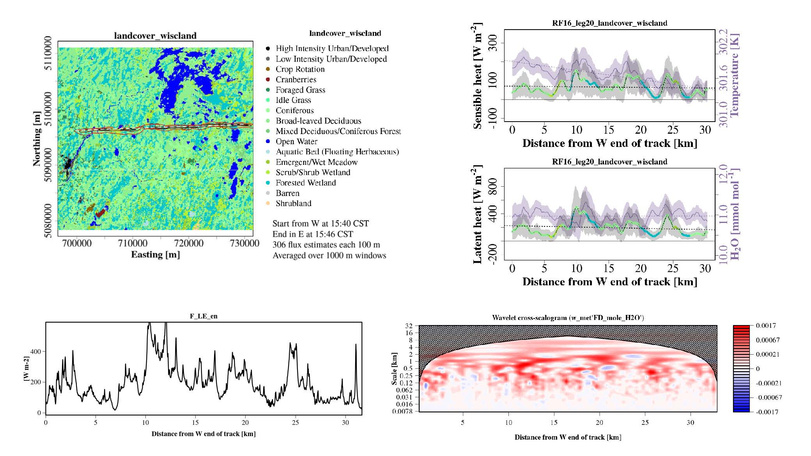

The earth’s surface is heterogeneous at multiple scales owing to spatial variability in various properties. The atmospheric responses to these heterogeneities through fluxes of energy, water,carbon and other scalars are scale-dependent and strongly non-linear. Measuring and quantifying these continuous multi-scale exchange processes call for state-of-the-art instrumentation and analyses.

Single point measurement techniques, like the conventional tower-based eddy-covariance measurements suffer from spectral losses in lower frequencies.They inherently can’t resolve these contributions using common averaging times. This calls for the application of spatially resolving measurement techniques, such as airborne measurements or a tower network and high resolution modeling efforts such as Large Eddy simulations, that can explicitly simulate all the pertinent scales of motion at all times. 

This is what we tried to do with the Chequamegon Heterogeneous Ecosystem Energy-balance Study Enabled by a High-density Extensive Array of Detectors.The field experiment aims to intensively sample and scale the interactions between land surface and the boundary layer across a 10 x 10 km, heterogeneous landscape in northern Wisconsin. Aimed to sample spatial heterogeneity and the seasonal shift in the landscape from a homogeneous LE dominated landscape in late summer to a more patchy, H dominated landscape in early autumn. 

Observational work: working on space-scale mapping of surface fluxes using airborne measurements. Wavelet analysis of flux measurements to diagnose and quantify scale transport. Flux footprint analysis to investigate contributions from surface features over the seasons.  from the experiment:

Modeling work:
Pre IOP work: Initial scenario analysis for field experiment design.
Parallelized Atmospheric LES Model (PALM), forced by surface flux maps from Metzger et al. 2013 (reanalysis calculated from tall tower measurements using ERF)

